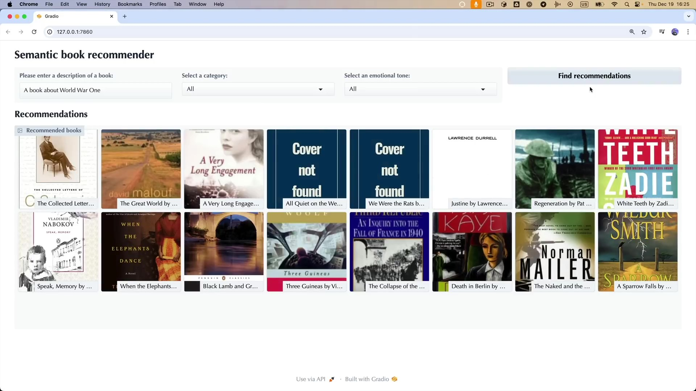

Semantic Book Recommender Using LLMs
=================================================

This project utilizes Large Language Models (LLMs) and semantic search to recommend books based on user input. It goes beyond traditional recommendation systems by using natural language understanding to find books with similar contextual meaning rather than relying on simple keyword matching.


## Project Overview

*Example image*


##


## Key Features
- [x] 📚 **AI-Powered Book Recommendations**– Uses LLM embeddings for highly relevant book suggestions.
- [x] 🔍 **Semantic Search** – Finds books based on contextual meaning rather than keyword matching.
- [x] 🎭 **Emotion-Based Filtering** – Allows sorting books by emotional tone (Happy, Suspenseful, Sad, etc.).
- [x] 📑 **Fiction vs. Non-Fiction Classification** – Helps users filter recommendations by book type.
- [x] ⚡ **Fast Vector Search with ChromaDB** – Enables real-time book retrieval using efficient embeddings.
- [x] 🎨 **Interactive Gradio UI** – Provides an easy-to-use interface for querying book recommendations.
- [x] 📷 **Book Cover Previews** – Displays high-quality book cover images alongside recommendations.
- [x] 🔗 **Real-Time Query Processing** – Instantly updates results as users modify their search criteria.
- [x] 💾 **Scalable Vector Storage** – Uses ChromaDB for storing and retrieving book embeddings efficiently.
- [x] 📖 **Kaggle Dataset Integration** – Supports preloaded datasets for better recommendations.
- [x] 🚀 **Optimized for accuracy, speed, and personalization!** 🚀

## How to Use

1. **Prepare Your Environment: .**:
    Ensure you have Python, Pandas, NumPy, and Gradio installed.

2. **Clone the Repository**:
    ```sh
    git clone https://github.com/Sandhit06/LLM-Semantic-Book-Recommender.git
    ```

3. **Run the Detection**:
    Navigate to the cloned directory and run:
    ```sh
   python gradio-dashboard.py
    ```

## Detailed System Workflow

### Initialization and Configuration
- **Dataset Loading:** The system loads a dataset of books from `books_with_emotions.csv`, which contains book titles, descriptions, emotional tags, and cover images.
- **Text Processing:** The descriptions are preprocessed for embedding generation.
- **Vector Database Setup:** Uses Google Generative AI Embeddings to convert book descriptions into vector representations stored in ChromaDB.

### Semantic Search and Filtering
- **Embedding Search:** When a user enters a query, it is embedded and compared to book vectors to find the most relevant recommendations.
- **Emotional Tone Filtering:** Books can be filtered based on emotional tone such as suspenseful, joyful, or sad.
- **Category Filtering:** Users can refine recommendations by selecting a book category (e.g., Fiction, Non-Fiction).

### Interaction and UI
- **Gradio-Based Interface:** Provides an interactive UI where users can enter book descriptions and receive recommendations.
- **Book Display:** Shows book covers, titles, authors, and short descriptions in an easy-to-read gallery format.
- **Real-Time Recommendations:** Instantly updates based on user input.


## Customizations

You can adjust several parameters including:
-**Initial and Final Top-K** results for refining recommendations.
-**Embedding Model:** Can switch from Google AI to OpenAI embeddings.
-**Tone filtering logic** to enhance emotion-based sorting.

## System Requirements
* [kagglehub](https://pypi.org/project/kagglehub/)
* [pandas](https://pypi.org/project/pandas/)
* [matplotlib](https://pypi.org/project/matplotlib/)
* [seaborn](https://pypi.org/project/seaborn/)
* [python-dotenv](https://pypi.org/project/python-dotenv/)
* [langchain-community](https://pypi.org/project/langchain-community/)
* [langchain-opencv](https://pypi.org/project/langchain-opencv/)
* [langchain-chroma](https://pypi.org/project/langchain-chroma/)
* [transformers](https://pypi.org/project/transformers/)
* [gradio](https://pypi.org/project/gradio/)
* [notebook](https://pypi.org/project/notebook/)
* [ipywidgets](https://pypi.org/project/ipywidgets/)

## Troubleshooting
No detections in the video
Ensure your model file is correctly loaded and the video file path is correct. Check if the video has clear visibility and minimal occlusions.

## ⚠ Disclaimer
This tool is developed for educational and developmental purposes. It's crucial to understand the implications and responsibilities of using such technologies in real-world applications.


## Still need help?
Open an issue on our GitHub repository, and we will help you as soon as possible.

Enjoy exploring and extending this project! Feel free to contribute and suggest improvements.

## Contact

If you want to contact me you can reach me at [Twitter](https://x.com/SandhitK).

## Developer
<table>
    <tr align="center">
        <td>
        Sandhit Karmakar
        <p align="center">
            
        </p>
            <p align="center">
                <a href = "https://github.com/Sandhit06">
                    
                </a>
                <a href = "https://www.linkedin.com/in/sandhit-karmakar/" target="_blank">
                    
                </a>
                <a href = "mailto:sandhitkarmakar@gmail.com" target="_blank">
                    
                </a>
            </p>
        </td>
    </tr>
</table>

<p align="center">
    Made with ❤️ by <a href="https://github.com/Sandhit06">Sandhit Karmakar</a>
</p>
